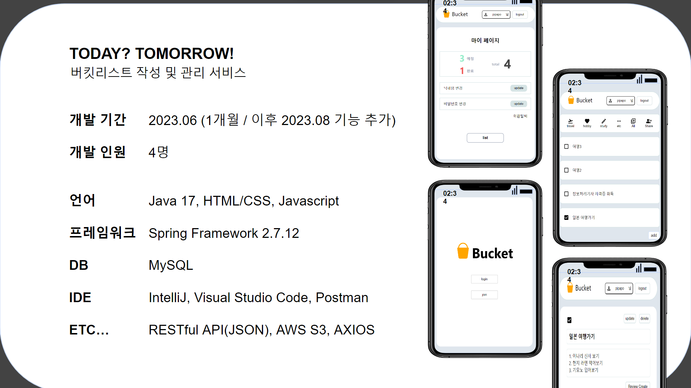
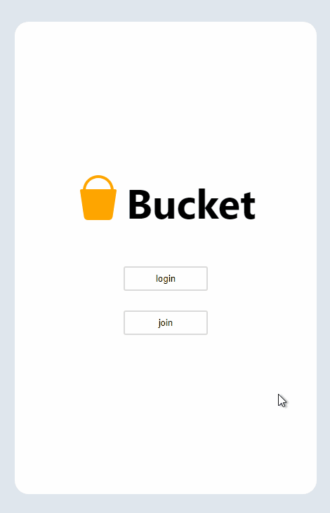
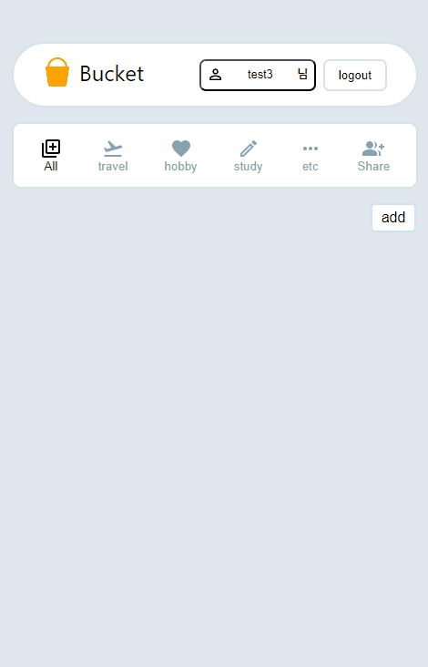
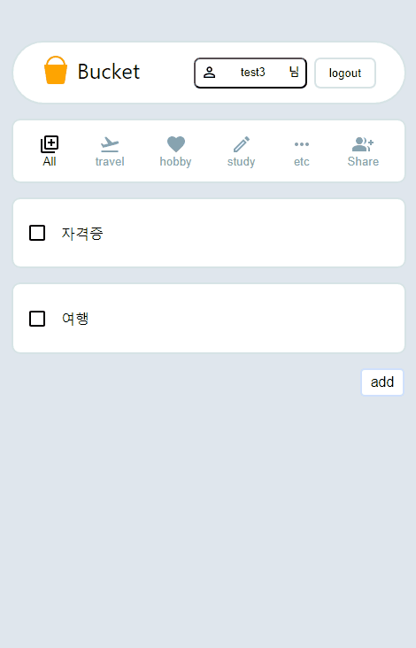
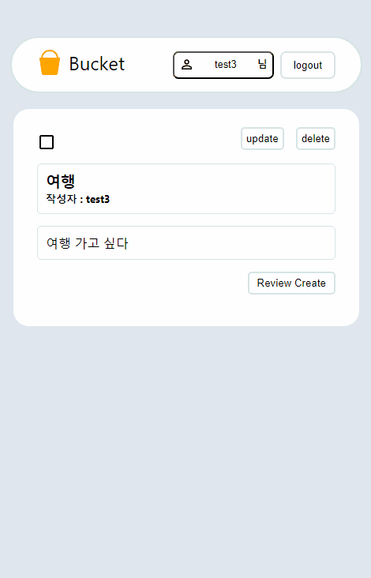
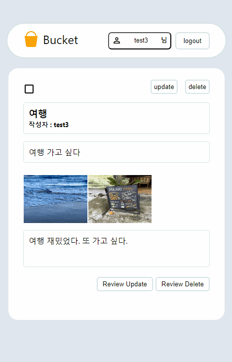
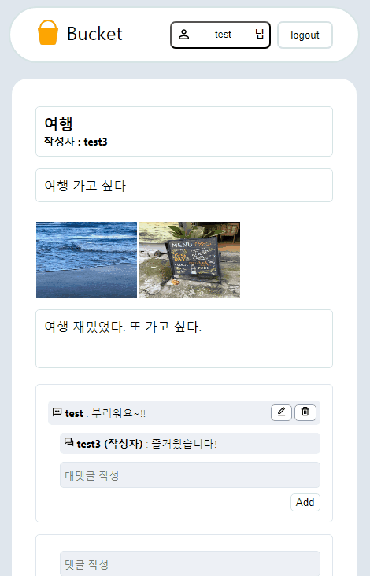
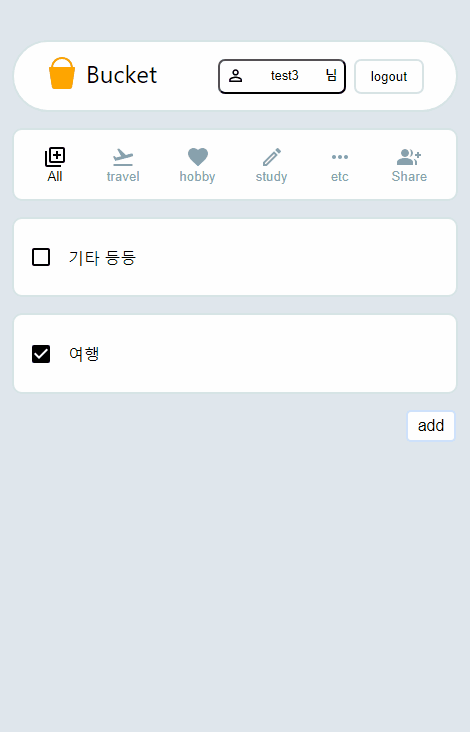
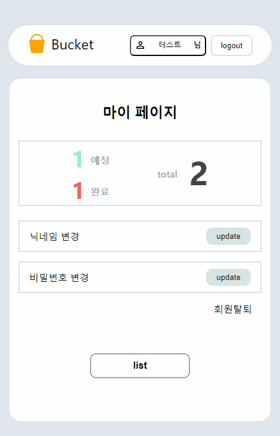

# Today? Tomorrow!

---

  버킷리스트를 작성하여 올리고, 다른 사용자와 경험을 나눌 수 있는 서비스입니다.  
  기본적인 CRUD에 집중하여 개발했으며 배포는 진행되지 않았습니다.

---

### 팀원 소개
|     김정수     |               손지아               |원정문|       이윤재       |
|:---------------:|:-------------------------------:|:---:|:---------------:|
| @kingzim468 |            @jia-son             |@ExpeditionMoon|    @gradesdc    |
| 메인 게시글 CRUD | 회원가입, 로그인 및 로그아웃 +공유 게시판  |리뷰 게시글 CRUD +댓글,대댓글|마이페이지, 회원정보 수정|
|             |<a href="https://www.introduce-jia.site/" target="_blank">개인 페이지</a>|<a href="https://velog.io/@expedition-moon/posts" target="_blank">개인 블로그</a>|                 |

---

### 프로젝트 상세 소개

#### 사용된 언어 : Java, Javascript, HTML/CSS
#### 프레임워크 : Spring Boot
#### 라이브러리 : React
#### 아키텍처 : 마이크로 서비스 아키텍처
#### DB : MySQL
#### ETC : AXIOS, JSON, AWS S3

 

#### 1. 회원 가입 및 로그인

회원 가입과 로그인을 진행할 수 있습니다. 
회원 가입시에는 ID와 닉네임에 대한 중복 검사가 들어갑니다.

 
 
 

#### 2. 버킷 리스트 작성, 수정, 삭제

버킷을 작성할 수 있습니다. 
버킷 작성 때에는 카테고리를 결정할 수 있으며, 추후 모든 게시글 목록 혹은 해당 카테고리에서 작성된 버킷을 확인할 수 있습니다. 
또, 작성한 버킷에 대한 수정과 삭제를 진행할 수 있습니다.

 
 
 

#### 3. 버킷에 대한 리뷰 작성

작성한 버킷을 실행했다면 그에 대한 리뷰를 작성할 수 있습니다. 
사진은 최대 3장까지 업로드할 수 있으며, 버킷과 마찬가지로 수정과 삭제가 가능합니다. 
또, 해당 버킷을 진행했다면 체크박스를 통해 실행 여부를 표시할 수 있습니다. 
해당 버튼은 어느 곳에서든 편하게 수정할 수 있습니다.

 
 
 

#### 4. 버킷 공유

나의 버킷은 share버튼을 통해 타사용자에게 공유할 수 있습니다. 
공유된 게시글은 공유 게시판에서 확인할 수 있고, 다른 사용자와 댓글을 통해 소통할 수도 있습니다. 
버킷에 대한 체크박스, 수정, 삭제 버튼은 작성자 본인에게만 보입니다.

 
 
 

#### 5. 댓글 기능

공유된 버킷에 댓글로 소통할 수 있습니다. 
작성자 본인의 댓글일 경우 닉네임 뒤에 (작성자)가 붙으며, 대댓글을 통해 지속적인 소통이 가능하도록 했습니다.

 
 
 

#### 6. 마이페이지, 회원 탈퇴

마이페이지에서 내가 작성한 게시글의 총 갯수와 그 중에서 완료 버튼이 체크된 게시글의 수를 확인할 수 있으며, 닉네임과 비밀번호 변경이 가능합니다. 
닉네임을 변경은 다른 사용자의 닉네임과 중복되는지 확인 후 진행됩니다. 
또, 사용자는 마이페이지에서 회원 탈퇴를 진행할 수 있습니다.
